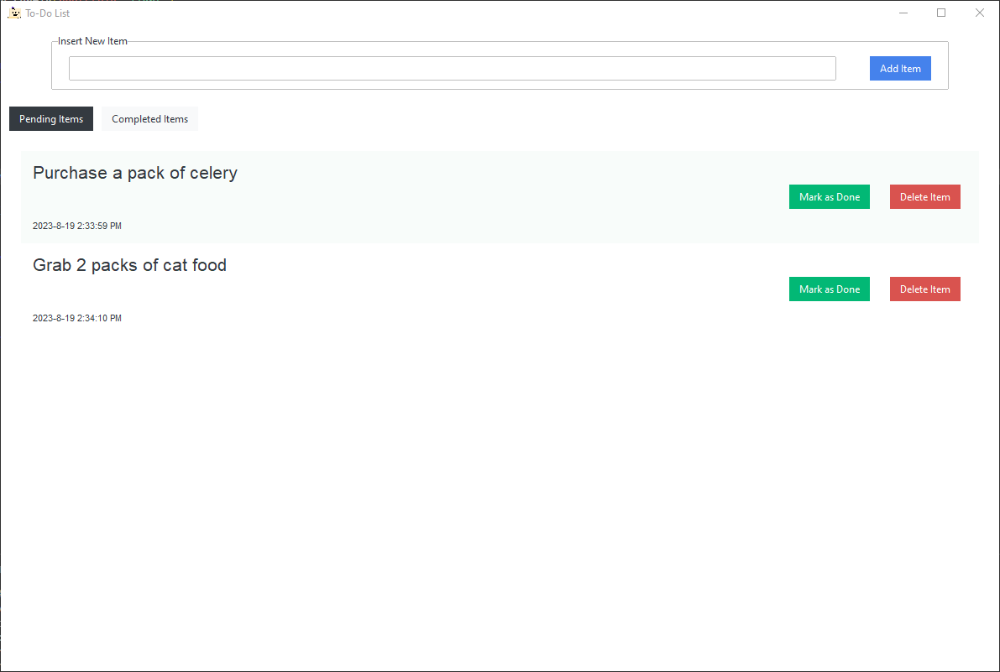
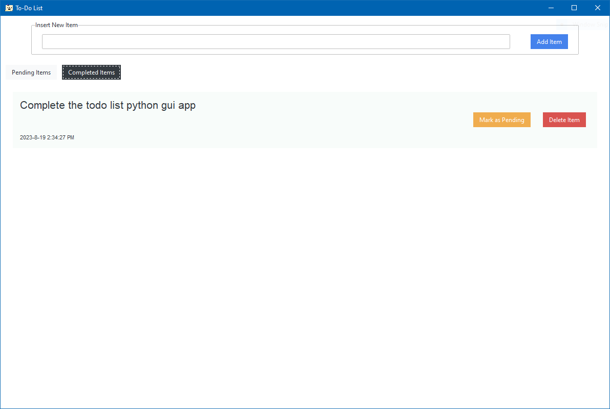

# To-do List Python GUI app

A to-do list application written in Python language, incorporating the use of regular `tkinter` as well as third-party library `ttkbootstrap`

## How to run

- Clone the repo or download as zip file and unzip it
- Open your terminal application and `cd` into the unzipped/clone repo folder
- Run `py app.py`

## UI Preview

### Main view (Pending Items List)

### Secondary view (Completed Items List)

